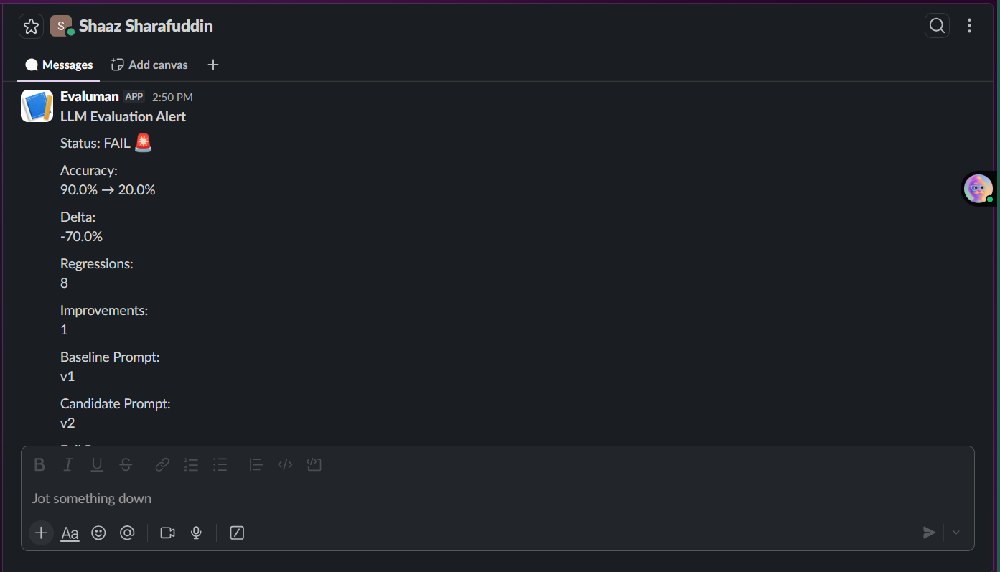
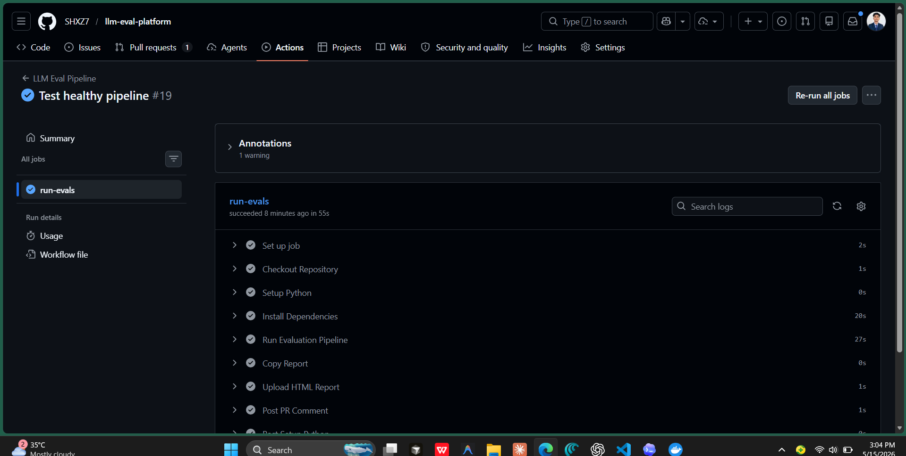
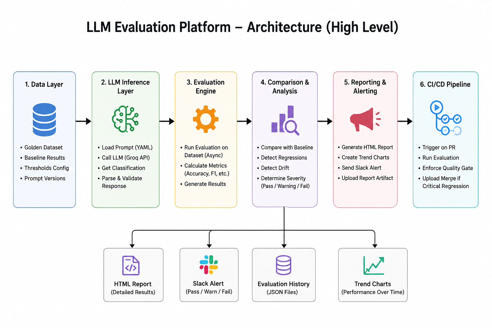

# LLM Evaluation Platform

## What This Does

This platform continuously evaluates LLM classifier performance against a golden dataset by comparing prompt versions, detecting accuracy drift, and alerting the team to regressions. When we deploy a new prompt iteration to production, we run it against 100+ historical email cases we've manually classified. The system compares predicted categories and summaries against ground truth, flags any accuracy drop above configurable thresholds, surfaces category-specific breakdowns, and notifies Slack with detailed HTML reports so we catch issues before they affect customers.

## In Action

**Slack Alert on Regression Detection**

*Real-time notification showing accuracy drop (90% → 20%), severity level, regressions count, and link to full report.*

**GitHub Actions Pipeline Execution**

*CI/CD pipeline successfully running all evaluation steps: checkout, setup Python, run evaluations, copy report, upload artifacts, post PR comment.*

## Setup

### Prerequisites
- Python 3.9+
- Docker (for containerized runs)
- API credentials: `GROQ_API_KEY` for LLM inference, `SLACK_WEBHOOK_URL` for alerting

### Local Development

```bash
# Clone and install
git clone <repo>
cd eval_proj
conda create -n eval python=3.9
conda activate eval
pip install -r requirements.txt

# Set environment variables
export GROQ_API_KEY=gsk_...
export SLACK_WEBHOOK_URL=https://hooks.slack.com/services/...

# Run evaluation
python main.py
```

### Docker (Production)

```bash
# Build
docker build -t llm-eval-platform .

# Run with thresholds
docker run \
  -e GROQ_API_KEY=gsk_... \
  -e SLACK_WEBHOOK_URL=https://... \
  -e WARNING_DELTA=0.03 \
  -e CRITICAL_DELTA=0.08 \
  llm-eval-platform
```

All threshold values are environment variables—no rebuild needed to adjust sensitivity.

## Adding Test Cases to Golden Dataset

The golden dataset is the source of truth. Every case must be hand-verified before adding.

### Format
Edit `data/golden_dataset_small.json` (or `golden_dataset_v1.json` for large runs):

```json
{
  "id": "case_042",
  "email": "Your customer email text here",
  "expected_category": "billing",
  "expected_summary": "Clear one-sentence summary of the issue"
}
```

### Workflow

1. **Find the raw email** - Check customer support logs, production errors, or feedback
2. **Classify manually** - Read the email; decide which category (billing, technical, account, general)
3. **Write ground truth summary** - One sentence capturing the core issue
4. **Add to dataset** - Append to the JSON array with a unique `case_XXX` ID
5. **Validate format** - Run `python -m json.tool data/golden_dataset_small.json` to ensure valid JSON
6. **Test locally** - Run `python main.py` once to ensure the case loads and evaluates

Keep case IDs sequential and descriptive. If a case is sensitive (PII), anonymize it before commit.

## Adjusting Thresholds

Thresholds control alerting sensitivity. They're used in two ways:

### 1. **Accuracy Delta Thresholds** (used in comparator.py)
- **WARNING_DELTA** (default 0.03): Alert if accuracy drops 3% between runs
- **CRITICAL_DELTA** (default 0.08): Page on-call if accuracy drops 8%

Example: If v1 prompt scored 92% and v2 scores 89%, delta is 3%—triggers a warning.

### 2. **Drift Detection Thresholds** (used in drift_detector.py)
- **DRIFT_WINDOW_SIZE** (default 7): Look at last 7 evaluation runs
- **DRIFT_THRESHOLD** (default 0.90): Flag if average accuracy in window falls below 90%

### How to Adjust

**For containerized runs:**
```bash
docker run \
  -e WARNING_DELTA=0.05 \
  -e CRITICAL_DELTA=0.12 \
  -e DRIFT_THRESHOLD=0.85 \
  llm-eval-platform
```

**For local testing:**
```bash
export WARNING_DELTA=0.05
export CRITICAL_DELTA=0.12
python main.py
```

**In configs/thresholds.yaml** (fallback defaults):
```yaml
warning_delta: 0.03
critical_delta: 0.08
drift_window_size: 7
drift_threshold: 0.90
```

The precedence is: `ENV vars > YAML defaults`. Always use ENV vars in production.

## System Architecture



**Full architecture details**: See [ARCHITECTURE.md](ARCHITECTURE.md) for complete component breakdown, data flows, and deployment topology.

### Core Layers

1. **Data Layer** - Golden datasets, baselines, configs
2. **LLM Inference** - Async classification with Groq (rate-limited)
3. **Evaluation Engine** - Comparison, drift detection, quality scoring
4. **Reporting** - HTML reports + Slack alerts
5. **Orchestration** - GitHub Actions CI/CD + Docker containerization

## Architecture Decisions

### Why Async Evaluation?
The `runner.py` uses `asyncio.Semaphore` to rate-limit API calls while running evaluations concurrently. We classify ~100 emails; serial calls would take 15+ minutes. Async keeps us under 3 minutes while respecting API limits and handling transient rate-limit errors with exponential backoff.

### Why Two-Phase Comparison?
`comparator.py` separates accuracy calculation from severity determination. This lets us:
- Compare global accuracy (did the new prompt regress overall?)
- Break down by category (is technical support worse now?)
- Determine severity independently (maybe 2% drop is OK for some projects)

The `judge.py` LLM scores summary quality, giving us a soft signal beyond binary correctness.

### Why Separate Config Files?
- `configs/thresholds.yaml`: Alert sensitivity (should vary by deployment)
- `app/llm/prompts/v1.yaml`, `v2.yaml`, etc: Prompt definitions (versioned, immutable)
- `data/golden_dataset_*.json`: Test cases (large variant for CI, small for dev)

This design lets you change thresholds without touching code or prompts, and evolve prompts independently from test data.

### Why HTML Reports + Slack Alerts?
Slack tells you *that* something broke and *why* (severity, affected categories). The HTML report (stored in `outputs/reports/`) contains full precision—category breakdowns, per-case diffs, historical trends. This split keeps alerts actionable while preserving auditability.

### Why Versioned Prompts in YAML?
LLM prompts are configs, not code. Storing them in YAML with version, description, few-shot examples, and parameters lets non-engineers iterate. Changing a prompt is data-driven, not a code deployment.

## Common Tasks

### Run a Quick Test
```bash
python main.py  # Uses v2.yaml prompt, small dataset
```

### Evaluate Against Larger Dataset
Edit `main.py`, change:
```python
dataset = load_dataset("data/golden_dataset_v1.json")
```

### Add a New Prompt Version
1. Copy `app/llm/prompts/v2.yaml` → `app/llm/prompts/v3.yaml`
2. Update `version`, `description`, and prompt text
3. Edit `main.py` to test it, then commit
4. Production integration happens in the orchestrator (separate repo)

### Debug a Failing Case
Check `outputs/eval_runs/eval_*.json` for the case ID. Look at:
- `predicted_category` vs `expected_category`
- `predicted_summary` vs `expected_summary`
- `summary_score` (0–1, from the judge LLM)

Then review the original email—either the golden truth is wrong, or the prompt needs refinement.

### Alert Thresholds Are Too Sensitive
Increase `WARNING_DELTA` and `CRITICAL_DELTA` via environment variables. This is safe and immediate—no rebuild needed.

## File Manifest

```
main.py                           # Entry point for local evaluation
requirements.txt                  # Python dependencies
Dockerfile                        # Container image for production runs

app/evals/
  runner.py                       # Async evaluation executor
  comparator.py                   # Accuracy calculation & severity logic
  config_loader.py                # Load thresholds (with ENV overrides)
  dataset_loader.py               # Load golden dataset
  drift_detector.py               # Historical trend detection
  judge.py                        # LLM-based summary quality scoring

app/llm/
  classifier.py                   # Email classification LLM call
  client.py                       # LLM client (Groq)
  prompts/v{1,2,3}.yaml          # Prompt versions (add new ones here)

app/models/
  schemas.py                      # Pydantic models (TestCase, EvalResult, etc.)

app/reporting/
  report_generator.py             # HTML report synthesis
  pr_comment.py                   # GitHub PR integration (if enabled)

app/alerting/
  slack_alert.py                  # Slack notification sender

configs/
  thresholds.yaml                 # Default threshold values

data/
  golden_dataset_small.json       # ~20 cases for local dev
  golden_dataset_v1.json          # ~100 cases for CI/production

outputs/
  eval_runs/                      # Raw eval results (JSON)
  reports/                        # Generated HTML reports
```

## Questions?

- **LLM is hallucinating:** Check prompt in `app/llm/prompts/v*.yaml`—add more few-shot examples or tighten instructions.
- **Slack alerts not firing:** Verify `SLACK_WEBHOOK_URL` and check `app/alerting/slack_alert.py` logs.
- **Accuracy dropped:** Check `outputs/reports/latest_report.html` for category breakdown; add representative test cases if a category is under-tested.
- **API rate limits:** Adjust `semaphore` value in `runner.py` or reduce batch size in `main.py`.
